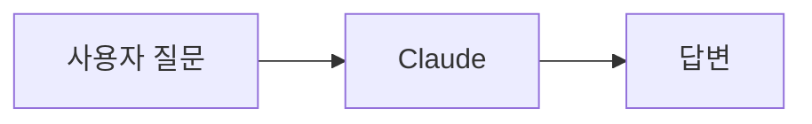
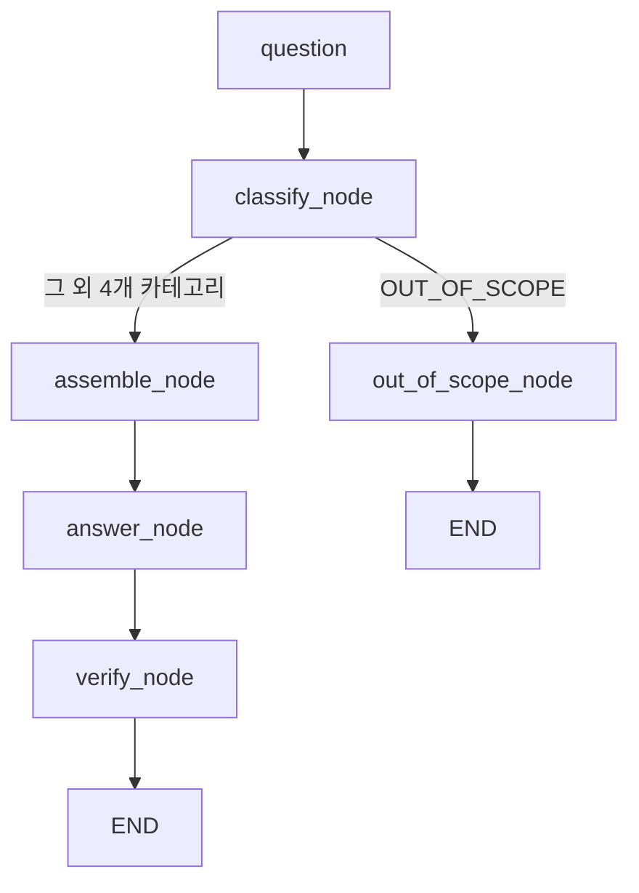

# N039 — AI Easy 레슨 챗봇 라우팅 에이전트

> N039 과제 요구사항: 성능 수치만이 아니라 "어떤 판단을 왜 했는지"를 정리한다. 이 문서는 단순 개발 기록이 아니라, 실제 서비스(AI Easy)를 대상으로 한 **AI 시스템 설계·실험 보고서**로 작성했다.

## 0. Executive Summary

본 프로젝트는 AI Easy 레슨 챗봇을 대상으로 **질문 라우팅 → 카테고리별 근거 조립 → 근거 기반 답변 → 답변 검증**의 4단계 파이프라인을 구현하고, 20개 평가셋으로 성능을 측정했다. Baseline에서 도구 호출 적절성 85%, 답변 적절성 90%를 확인했으며, 카테고리 설명을 한 차례 개선한 결과 도구 호출 적절성은 90%로 향상됐다. 그러나 기존 오류 3건이 해결되는 동시에 새로운 오류 2건이 발생해, **AI 시스템의 개선은 단순한 점진적 최적화가 아니라 분류 경계와 근거 구조 전체를 함께 고려해야 하는 문제**임을 확인했다.

| | |
|---|---|
| **문제** | 배포된 AI Easy 챗봇은 질문을 그대로 LLM에 넘길 뿐, 분류·근거 제한·검증·평가가 전혀 없다 |
| **해결 방법** | LangGraph 기반 4노드(분류→근거조립→답변→검증) 파이프라인 + 20문항 평가셋 |
| **실험 결과** | 도구 호출 적절성 85%→90%, 답변 적절성 90%→90% (오류 3건 해결, 2건 신규 발생) |
| **핵심 발견** | 카테고리는 틀려도 답이 맞을 수 있고(Q12), 라우팅이 틀려도 그라운딩·검증이 있으면 거짓 답변은 막힌다(Q05) — 두 지표를 분리 측정해야 하는 이유가 실측으로 드러남 |

## 1. 문제 정의

### 1-1. 기존 챗봇 구조

배포된 [`04_개발/챗봇-서버리스/src/index.js`](https://github.com/JEON-DAEJIN/ai-easy/blob/main/04_개발/챗봇-서버리스/src/index.js)의 `callClaude()`는 질문을 곧바로 LLM에 넘기는 1단계 구조다.



시스템 프롬프트에는 `lesson_id`라는 **문자열 하나**만 들어가고, 레슨 본문은 어디에도 주입되지 않는다.

### 1-2. 발견한 문제

- **라우팅 없음** — 질문 종류를 분류하지 않는다.
- **그라운딩 없음** — 레슨 본문을 실제로 읽지 않고 Claude의 일반 지식으로 답한다.
- **검증 없음** — 답변이 근거에 맞는지 사후 검사하는 절차가 없다.
- **평가 없음** — 성능을 잴 평가셋이 없어 "잘 되는 것 같다"는 느낌으로만 판단한다.
- **구체적 위험**: 레슨3 본문이 스스로 경고하는 사례("한 항공사 챗봇이 환불 규정을 잘못 안내해 배상 책임을 진 사례")를, 그라운딩 없는 이 챗봇이 SERVICE류 질문(요금·환불 등)에서 그대로 재현할 위험이 있다.

### 1-3. 왜 N039 구조가 필요한가

N039 학습서는 "배운 것은 고객응대가 아니라 구조"라고 명시한다 — 입력을 카테고리로 나누고, 카테고리마다 다른 근거를 붙이고, 근거에 없는 것을 지어내지 못하게 막고, 성능을 숫자로 증명하는 구조다. 이 구조를 실제 배포 코드에 적용하면 위 1-2절의 문제를 각각 대응되는 노드(분류/근거조립/검증/평가)로 해소할 수 있다.


## 2. 목표 및 설계 원칙

| 원칙 | 이 프로젝트에서의 의미 |
|---|---|
| Routing | 질문을 5개 카테고리 중 하나로 분류해, 이후 어떤 문서를 볼지 결정하는 제어 신호로 쓴다 |
| Grounding | 카테고리에 매핑된 문서만 근거로 주고, 문서 전체를 주지 않는다 |
| Out-of-Scope | 근거가 없는 질문은 답을 지어내지 않고 정해진 문구로 넘긴다 |
| Verification | "근거에 없는 내용을 말하지 마라"는 지시와 별개로, 답변의 주장을 근거와 대조하는 노드를 둔다 |
| Evaluation | 20문항 평가셋으로 도구 호출 적절성·답변 적절성을 숫자로 측정한다 |

## 3. 카테고리 및 근거 설계

### 3-1. 카테고리 — 분류 기준과 답변 행동

| 카테고리 | 분류 기준 | 답변 행동 |
|---|---|---|
| CONCEPT | AI의 원리·한계를 묻는가 | L01/L03 근거로 답변 |
| PROMPT | AI에게 지시하는 방법을 묻는가 | L02/L04 근거로 답변 |
| APPLY | 실제 활용·다음 행동을 묻는가 | L05/L06 근거로 답변 |
| SERVICE | 앱 자체의 이용 정보를 묻는가 | 서비스 문서로 답변 |
| OUT_OF_SCOPE | 현재 지식 범위를 벗어나는가 | 답변하지 않고 넘김 |

카테고리 → 근거 → 행동이 한 줄로 이어지도록 설계했다 — 카테고리가 정해지면 어떤 문서를 볼지, 근거가 없으면 어떻게 행동할지가 표 하나로 결정된다.

### 3-2. 문서 매핑

| 카테고리 | 연결 문서 |
|---|---|
| CONCEPT | `docs/레슨1_AI는_도대체_뭘까.md`, `docs/레슨3_AI가_잘하는것_못하는것.md` |
| PROMPT | `docs/레슨2_프롬프트란_무엇인가.md`, `docs/레슨4_나만의_첫_프롬프트_써보기.md` |
| APPLY | `docs/레슨5_AI로_일상문제_해결하기.md`, `docs/레슨6_AI를_계속_배우는법.md` |
| SERVICE | `docs/서비스이용_안내.md` |
| OUT_OF_SCOPE | 없음 → 넘기기 |

근거 문서는 전부 대표님이 이미 검수·확정(published)한 실제 AI Easy 레슨 콘텐츠다 — 새로 지어낸 문서가 없어 매핑표가 곧 실제 서비스 구조와 일치한다.

### 3-3. OUT_OF_SCOPE 정의

OUT_OF_SCOPE를 "완전 무관 질문"만이 아니라 **"아직 없는 트랙(영어·수학)의 실질적 내용을 대신 수행해달라는 요청"**까지 포함하도록 정의했다. 이 두 종류를 구분하지 않으면 "수학 트랙이 있나요?"(→ SERVICE, 문서로 답 가능)와 "3x+5=20 풀어줘"(→ OUT_OF_SCOPE, 근거 없음)를 라우터가 구분하지 못한다.

### 3-4. 설계 이유

레슨 6개의 실제 "목적"(메타데이터)을 두 개씩 묶어 CONCEPT/PROMPT/APPLY 3개를 만들고, 레슨 콘텐츠가 아닌 "앱 이용 자체" 질문을 위해 SERVICE를, 트랙1과 무관한 질문을 위해 OUT_OF_SCOPE를 추가해 5개를 완성했다.

## 4. 평가셋 설계

| 평가 설계 요소 | 설계 내용 | 목적 |
|---|---|---|
| 총 문항 | 20개 | 기본 성능 측정 |
| 카테고리 | 5개 | 라우팅 평가 |
| 카테고리별 | 4개 | 균형 평가 |
| OUT_OF_SCOPE | 4개 | 거절 능력 평가 |
| 필수 사실 | 문항별 정의 | 정보 누락 측정 |
| 금지 사실 | 문항별 정의 | 환각 측정 |
| Few-shot | 별도 10개 | 평가 오염 방지 |

- **출처**: 모든 문항은 실제 레슨 1~6과 `서비스이용_안내.md` 내용에서 답이 검증 가능하도록 작성했다. OUT_OF_SCOPE 4건은 "완전 무관 질문"(날씨, 주식)과 "아직 없는 트랙에 실질적 도움을 요청하는 질문"(수학 문제, 영어 번역)을 섞어, 라우팅이 표면적 키워드가 아니라 실제 답변 가능 여부를 보게 설계했다.
- **금지 사실**은 레슨 퀴즈의 오답 보기를 그대로 재활용했다 — 이미 "문서를 안 읽으면 나오기 쉬운 그럴듯한 오답"으로 검증된 문장들이다.
- **Few-shot 분리**: 분류 프롬프트의 few-shot 예시는 `data/fewshot_examples.json`(10건)에서만 가져오고, `data/eval_set.csv`의 20문항은 절대 프롬프트에 노출하지 않는다 — 평가 오염(암기)을 막기 위함이다.

## 5. Agent Architecture

### 5-1. 전체 구조



### 5-2. State / Node / Edge

- **State**: `{question, category, evidence, answer, validation}` (`agent.py`의 `AgentState`)
- **Node**: `classify_node`(분류) → `assemble_node`(근거조립) → `answer_node`(답변) → `verify_node`(검증), 그리고 `out_of_scope_node`(고정 응답)
- **Edge**: `classify_node`의 조건부 엣지가 카테고리에 따라 `assemble_node` 또는 `out_of_scope_node`로 분기시킨다

### 5-3. OUT_OF_SCOPE 분기

`classify_node`가 OUT_OF_SCOPE로 판정하면 근거 조립·답변 생성 없이 즉시 `out_of_scope_node`(고정 넘기기 응답)로 분기한다 — 불필요한 API 호출과 환각 위험을 원천 차단하기 위한 설계다.

## 6. 실험

평가를 실행하기 전 API 인증 오류가 발생했으나(형식이 다른 키를 사용) 올바른 Anthropic API Key로 교체 후 정상 실행을 확인했다. 키를 다른 프로젝트의 `.env`에서 자동 복사하려는 과정에서 자격증명 접근이 차단되어 수동 입력으로 처리했으며, 키 값 자체는 저장소나 본 문서에 노출하지 않았다.

| 실험 | 변경한 변수 | 고정한 변수 |
|---|---|---|
| Baseline | — | 모델(`claude-haiku-4-5-20251001`), 프롬프트 구조, 근거 조립 방식, few-shot 10건 |
| 개선 1 | `CATEGORY_DESCRIPTIONS`에 "무엇을 묻는 질문인지" 판별 기준 문장 추가 | 위와 동일 (모델·프롬프트 구조·근거 조립·few-shot 전부 고정) |

"한 번에 하나씩 바꾸고 재측정한다"는 원칙에 따라 분류 카테고리 설명 문구 하나만 바꾸고 나머지는 전부 고정했다.

## 7. 결과

### 7-1. 정량 결과

```
도구 호출 적절성
Baseline   █████████████████                  85% (17/20)
개선 1     ██████████████████                 90% (18/20)

답변 적절성
Baseline   ██████████████████                 90% (18/20)
개선 1     ██████████████████                 90% (18/20)  ← 변화 없음
```

(Baseline 상세는 `data/eval_results_baseline.csv`, 개선 1 상세는 `data/eval_results.csv`)

### 7-2. 오류 이동표

| 실험 | 기존 실패 | 해결 | 새 실패 | 도구 호출 적절성 |
|---|---|---|---|---|
| Baseline | Q06, Q10, Q12 | - | - | 85% |
| 개선 1 | Q06, Q10, Q12 | 3건 해결 | Q04, Q05 | 90% |

> 한 가지 분류 기준을 강화했을 때 기존 오류가 감소했지만, 새로운 경계 오류가 발생했다. 따라서 라우팅 개선은 전체 평가셋을 반복 측정하면서 진행해야 한다. **이것이 이번 실험의 가장 교육적인 결론이다.**

### 7-3. Case Study

**Case A — Q12 (라우팅 실패 + 답변 성공)**
- 정답 카테고리: `APPLY` / 실제 카테고리: `CONCEPT`
- 답변: 정답에 가까움 (레슨3과 레슨6이 "AI 결과는 사람이 검증해야 한다"는 같은 결론을 공유하기 때문)

**Case B — Q05 (라우팅 실패 + 환각 방지 성공)**
- 정답 카테고리: `PROMPT` / 실제 카테고리: `CONCEPT`
- 답변: "근거 자료에 정확한 설명이 없어 답변드릴 수 없습니다" — 근거 부족을 이유로 답변 거부

이 두 사례를 나란히 보면 **"왜 라우팅 점수와 답변 점수를 따로 봐야 하는가"**가 바로 이해된다 — 라우팅이 틀려도 답이 맞을 수 있고(A), 라우팅이 틀려도 최소한 거짓말은 안 할 수 있다(B).

### 7-4. 과잉보정 사례 (Q04)

PROMPT 설명에 "답변 품질이 다른 이유"라는 문구를 추가하자, 이 문구가 Q04("AI의 실력을 가장 크게 좌우하는 것은?", 정답 CONCEPT/데이터 품질)까지 끌어와 PROMPT로 잘못 라우팅시켰다. 카테고리 설명을 구체화하는 과정에서 생긴 전형적인 과잉보정이다.

## 8. 무엇을 배웠는가

- **Routing과 Answer는 다르다** — Q12가 보여주듯 카테고리 판정과 답변 품질은 별개의 축이다. 하나의 점수만 봤다면 라우팅 오류 자체를 놓쳤을 것이다.
- **Grounding은 안전장치다** — Q05가 보여주듯, 라우팅이 틀려도 근거 제한과 검증이 있으면 최소한 거짓 답변(환각)은 막힌다.
- **검증은 지시와 다르다** — "근거 밖 내용을 말하지 마라"는 프롬프트 지시만으로는 부족하다. `verify_node`가 답변의 주장을 근거와 실제로 대조해야 한다.
- **AI 개선은 반복 실험이다** — Q04의 과잉보정 사례처럼, 한 곳을 고치면 다른 곳에서 새 문제가 생길 수 있다. 그래서 매번 전체 평가셋을 다시 재야 하고, 한 번에 여러 곳을 동시에 고치면 원인을 알 수 없다.
- 이 네 가지는 N039 12장의 "AI 서비스 기획자의 8가지 질문"(카테고리→근거→검증→측정→개선 노드)과 정확히 대응한다.

## 9. 데모

`streamlit run app.py`로 실제 실행해 두 가지 대표 케이스를 확인했다.

**케이스 1 — 정상 카테고리 (SERVICE)**
- 질문: "챗봇 질문은 하루에 몇 번까지 무료인가요?"
- 답변: "챗봇 질문은 레슨 하나당 하루 3회까지 무료입니다. 매일 한국시간 자정을 기준으로 횟수가 초기화되며, 무료 횟수를 다 쓰면 그날은 그 레슨에서 더 이상 질문할 수 없습니다. 다음날이 되면 다시 3회가 채워집니다."
- 분류 결과: `SERVICE` / 호출한 근거 문서: `docs/서비스이용_안내.md` / 검증 결과: ✓ 통과

**케이스 2 — 범위 밖 (OUT_OF_SCOPE)**
- 질문: "3x+5=20이면 x는 얼마야?"
- 답변: "이 질문은 지금 배우고 계신 'AI로 AI 공부하는 법' 트랙 범위 밖이라, 정확한 답을 드리기 어려워요. 트랙 내용으로 다시 질문해 주시겠어요?"
- 분류 결과: `OUT_OF_SCOPE` / 호출한 근거 문서: 없음 / 검증 결과: ✓ 통과

최종 답변 한 줄만 보여주지 않고 **분류 결과 → 호출한 근거 문서 → 검증 결과**를 항상 함께 노출한 것이 N039 10장이 말하는 관찰가능성이다.

## 10. 한계와 다음 실험

### 10-1. 현재 한계

- 평가셋 20문항은 통계적으로 크지 않다 — 85%와 90%의 차이(1문항)가 우연일 가능성을 배제할 수 없다.
- 검증 노드(`verify_node`) 자체도 LLM 판단에 의존하며, 검증 자체의 정확도는 별도로 측정하지 않았다.
- 기존 구조가 질문당 1회 LLM 호출이었다면, 현재 구조는 분류·답변·검증 과정에서 **최대 3회**의 LLM 호출이 발생한다. 따라서 호출 횟수는 최대 3배가 될 수 있으며, 실제 비용 증가는 각 단계의 입력·출력 토큰량에 따라 달라진다.
- `context.py`는 카테고리당 문서 전체를 근거로 넣는다 — 문서가 길어지면 세분화가 필요하다.

### 10-2. 다음 실험 가설

- **가설 1**: PROMPT의 판별 기준을 "답변 품질"이 아니라 "사용자가 AI에게 어떤 지시를 제공하는가"로 좁히면 Q04·Q05 오류가 감소할 것이다.
- **가설 2**: CONCEPT에 "AI 성능에 영향을 주는 데이터 품질"을 명시하면 PROMPT와의 경계가 명확해질 것이다.
- **가설 3**: 평가셋을 20 → 50~100개로 확대하면 현재 90% 성능이 안정적인지 확인할 수 있을 것이다.

## 11. 회고

**가장 공들인 부분**: 평가셋의 "금지 사실"을 레슨 퀴즈의 오답 보기에서 그대로 재활용한 것. 또한 채점기 자체를 모범답안/오답으로 먼저 검증하고 나서야(`self_test_judge()`) 20문항 채점 결과를 신뢰하기로 한 순서도, "AI를 평가하는 시스템도 테스트해야 한다"는 원칙을 코드 구조로 강제한 부분이라 의미 있었다.

**향후 개선점 (실제 ai-easy 서비스에 이식할 때 고려할 점)**:
- 레슨(트랙)이 늘어나도 분류 정확도가 유지되는지 재검증해야 한다.
- `agent.py`의 `run(question)` 인터페이스를 실제 Worker의 `handleChat()`과 입력 형태를 맞춰 두었으므로, 이 로직을 Cloudflare Workers(JS)로 이식하거나 별도 서비스로 분리하는 방안을 다음 단계에서 검토한다.
