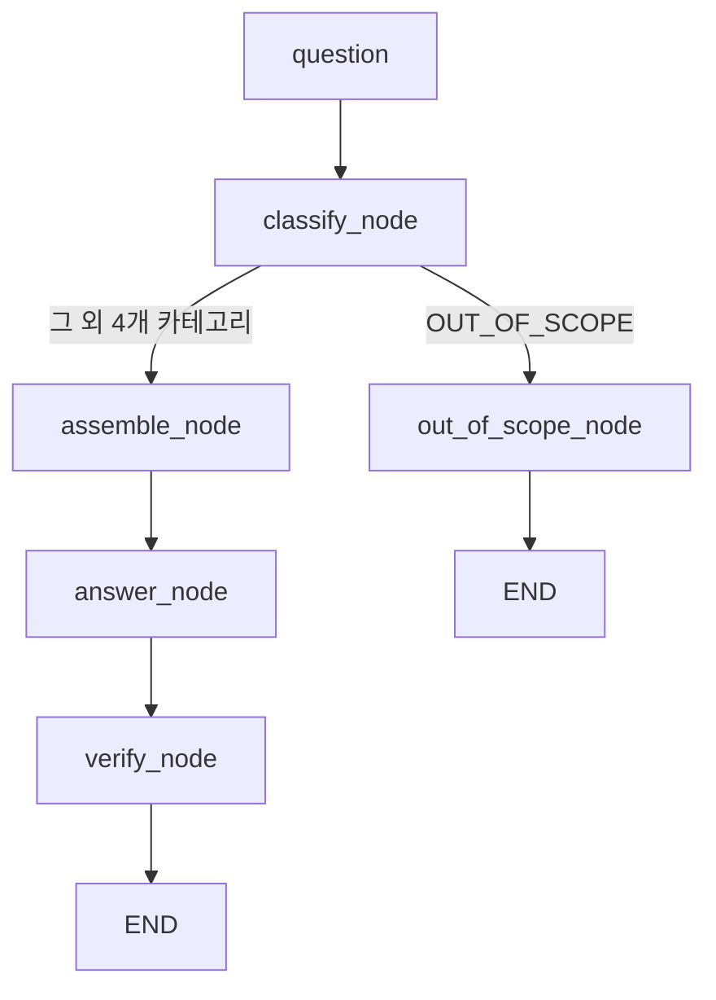

# REPORT — AI Easy 레슨 챗봇 라우팅 에이전트

> N039 과제 요구사항: 성능 수치만이 아니라 "어떤 판단을 왜 했는지"를 아래 7가지로 정리한다.

## 1. 주제와 근거 문서

실제로 운영 중인 서비스 [AI Easy(에이지)](https://github.com/JEON-DAEJIN/ai-easy)의 레슨 챗봇을 골랐다.
가상 시나리오 대신 이 주제를 고른 이유는, 이미 배포된 챗봇([`04_개발/챗봇-서버리스/src/index.js`](https://github.com/JEON-DAEJIN/ai-easy/blob/main/04_개발/챗봇-서버리스/src/index.js))이
라우팅·그라운딩·검증·평가가 전혀 없는 상태로 실제 사용자에게 노출될 예정이었기 때문이다.
근거 문서는 이미 대표님이 직접 검수·확정(published)한 레슨 1~6 원본(`docs/레슨*.md`)과, 종합계획서·핸드오프문서에서
사용자가 물어볼 만한 "서비스 자체 사실"만 추려 새로 작성한 `docs/서비스이용_안내.md` 1건이다. 근거 문서를
새로 지어내지 않고 실제 검수된 콘텐츠를 그대로 썼기 때문에, 카테고리-문서 매핑표가 곧 실제 서비스 구조와 일치한다.

## 2. 카테고리 설계

5개 카테고리(CONCEPT/PROMPT/APPLY/SERVICE/OUT_OF_SCOPE)는 레슨 6개의 실제 목적(메타데이터의 "목적" 필드)을
두 개씩 묶어 만들었다 — 레슨1·3(개념 입문/한계) → CONCEPT, 레슨2·4(프롬프트 작성법/실습) → PROMPT,
레슨5·6(활용 사례/다음 단계) → APPLY. 여기에 레슨 콘텐츠가 아닌 "앱 이용 자체"에 대한 질문을 위해 SERVICE를,
트랙1과 무관한 질문을 위해 OUT_OF_SCOPE를 추가했다.

카테고리-문서 매핑표는 README.md 참고. 매핑표 설계에서 가장 신경 쓴 지점은 OUT_OF_SCOPE를
"완전 무관 질문"만이 아니라 "아직 없는 트랙(영어·수학)의 실질적 내용을 대신 수행해달라는 요청"까지
포함하도록 정의한 것이다 — 이 두 종류를 구분하지 않으면 "수학 트랙이 있나요?"(SERVICE, 문서로 답 가능)와
"3x+5=20 풀어줘"(OUT_OF_SCOPE, 근거 없음)를 라우터가 구분하지 못한다.

## 3. 평가셋 설계

- **문항 수**: 20건, 카테고리별 정확히 4건씩(CONCEPT/PROMPT/APPLY/SERVICE/OUT_OF_SCOPE) 균등 배분
- **출처**: 모든 문항은 실제 AI Easy 레슨 1~6과 서비스이용_안내.md 내용에서 답이 검증 가능하도록 작성. OUT_OF_SCOPE 4건은 "완전히 무관한 질문"(날씨, 주식)과 "아직 없는 트랙에 실질적 도움을 요청하는 질문"(수학 문제 풀이, 영어 번역)을 섞어 구성 — 후자는 "이 앱에 그런 트랙이 있나요?"(→ SERVICE, 문서에 답 있음)와 "그 문제 자체를 풀어줘"(→ OUT_OF_SCOPE, 문서에 없음)를 구분해서 라우팅 판정이 표면적 키워드가 아니라 실제 답변 가능 여부를 보게 설계
- **기대 도구/필수 사실/금지 사실 근거**: `data/answer_gold.json`에 문항별로 기록. 필수 사실은 레슨 본문의 핵심 문장을 그대로 사실 단위로 쪼갠 것이고, 금지 사실은 레슨 퀴즈의 오답 보기(그럴듯하지만 틀린 선택지)를 재활용해 만듦 — 이미 "문서를 안 읽으면 나오기 쉬운 오답"으로 검증된 문장들이라 금지사실 설계에 그대로 재사용 가능했음
- **평가용/예시용 분리**: 프롬프트 few-shot 예시는 `data/fewshot_examples.json`(10건, eval_set과 문항 100% 비중복)에서만 가져오도록 분리. `data/eval_set.csv`의 20문항은 절대 프롬프트에 노출하지 않음

## 4. 측정 결과

채점기 자체 검증(모범답안 PASS / 의도적 오답 FAIL)을 먼저 통과시킨 뒤 20문항을 실측했다. 모델은
`claude-haiku-4-5-20251001`, 각 지표는 20문항 전체 대비 비율이다.

| 시도 | 변경 내용 | 도구 호출 적절성 | 답변 적절성 |
|---|---|---|---|
| Baseline | `CATEGORY_DESCRIPTIONS`를 카테고리당 한 문장으로만 작성 | 85% (17/20) | 90% (18/20) |
| 개선 1 | `CATEGORY_DESCRIPTIONS`에 "무엇을 묻는 질문인지"를 구분하는 판별 기준 문장을 추가(그 외 변수는 전부 고정) | 90% (18/20) | 90% (18/20) |

(Baseline 상세는 `data/eval_results_baseline.csv`, 개선 1 상세는 `data/eval_results.csv`)

**오류 원인 분석**

- **Q06·Q10·Q12 (Baseline 실패 → 개선 1에서 해결)**: CONCEPT("AI 자체의 한계")와 PROMPT/APPLY("어떻게 하면 좋을지")가
  표면적으로 비슷한 질문 형태를 가져 혼동됐다. 예를 들어 Q06 "같은 AI인데 답변 품질이 다를 때가 있는 이유는?"이
  CONCEPT(레슨3 데이터 품질)로 잘못 라우팅돼, 근거에 있지도 않은 "데이터가 부족하면 엉뚱한 결과가 난다"는
  내용으로 답변했다 — 원인이 "AI의 한계"가 아니라 "사용자의 프롬프트가 애매했기 때문"이라는 레슨2의 요지와
  반대되는 답이 나온 것. 카테고리 설명에 "원인이 AI 한계인가, 사용자 지시 방식인가"를 명시하자 해결됐다.
- **Q12는 카테고리가 틀렸는데도 답변은 우연히 통과했다**: 레슨3("AI 결과를 검증하는 습관")과 레슨6("최종 판단은
  사람의 몫")이 표현은 다르지만 같은 결론을 공유하기 때문이다. 이는 N039가 강조하는 "도구 호출 적절성과 답변
  적절성을 별도로 측정해야 하는 이유"를 실측으로 보여준 사례 — 카테고리가 틀려도 답이 맞을 수 있고, 반대로
  카테고리가 맞아도 답이 틀릴 수 있다(Q06·Q10처럼).
- **Q04·Q05 (개선 1에서 새로 발생, 과잉보정)**: PROMPT 설명에 "답변 품질이 다른 이유"를 추가하자, 이번엔 그
  문구가 Q04("AI의 실력을 가장 크게 좌우하는 것은?", 정답은 CONCEPT/데이터 품질)까지 끌어와 PROMPT로 잘못
  라우팅시켰다. Q05("프롬프트가 뭔가요?")는 반대로 CONCEPT로 잘못 갔는데, 이 경우 답변 노드는 "근거 자료에
  정확한 설명이 없어 자세히 답변드릴 수 없습니다"라고 **정직하게 실패**했다 — 라우팅이 틀려도 그라운딩·검증
  구조 덕분에 그럴듯한 거짓 답변(환각)은 만들어내지 않았다는 뜻이다. 이것이 N039가 말하는 "모를 때 멈출 수
  있는 시스템"이 실제로 작동한 순간이라고 본다.
- **다음 개선 방향(미실행)**: PROMPT 설명의 "답변 품질이 다른 이유" 문구를 "지시(프롬프트)를 어떻게 쓰느냐에
  따라"로 더 좁히고, CONCEPT 설명에 "AI 실력 자체가 무엇에 좌우되는지(데이터 품질)"를 대칭적으로 명시하면
  Q04·Q05 재발을 막을 수 있을 것으로 예상한다. 이번 세션에서는 "한 번에 하나씩 바꾸고 재측정한다"는 원칙을
  지키기 위해 개선 1회분까지만 진행하고 멈췄다.

## 5. 파이프라인 구조도

State = `{question, category, evidence, answer, validation}` (agent.py `AgentState`).
`classify_node`가 OUT_OF_SCOPE로 판정하면 근거 조립·답변 생성 없이 바로
`out_of_scope_node`(고정 넘기기 응답)로 분기하고, 그 외에는 근거 조립 → 답변 →
검증(답변 주장을 근거와 대조)까지 순서대로 거친다.

## 6. 데모 설계

> ⏸ `streamlit run app.py` 실행 대기 중. 실행 후 화면 캡처와 신경 쓴 부분을 이 절에 채울 것.

## 7. 프로젝트 회고

**가장 공들인 부분**: 평가셋의 "금지 사실"을 레슨 퀴즈의 오답 보기에서 그대로 재활용한 것. 퀴즈 오답은
이미 "문서를 안 읽으면 나오기 쉬운 그럴듯한 오답"으로 대표님이 검수해 둔 문장들이라, 새로 지어낸 오답보다
훨씬 신뢰도 높은 채점 기준이 됐다. 또한 채점기 자체를 모범답안/오답으로 먼저 검증하고 나서야 20문항 채점
결과를 신뢰하기로 한 순서(`self_test_judge()`를 `main()` 맨 앞에서 항상 먼저 실행)도, "AI를 평가하는 시스템도
테스트해야 한다"는 원칙을 코드 구조로 강제한 부분이라 의미 있었다.

**개선 실험에서 배운 것**: 카테고리 설명 한 군데를 구체화했더니 기존 실패 3건은 고쳤지만 새로운 실패 2건이
생겼다(85%→90%, 순변화는 +1건). "한 번 고치면 끝"이 아니라 매번 전체 20문항을 다시 재는 것이 왜 필수인지
직접 확인했다. 특히 Q05처럼 라우팅이 틀려도 그라운딩·검증 구조가 거짓 답변을 막아준 사례는, 이 구조를
왜 만드는지에 대한 가장 확실한 증거였다.

**향후 개선점 (실제 ai-easy 서비스에 이식할 때 고려할 점)**:
- 지금은 카테고리 판정에 Claude Haiku 1회 호출만 쓰는데, 실제 서비스에서는 레슨 6개보다 트랙이 늘어날 것이므로
  카테고리 수가 늘어나도 분류 정확도가 유지되는지 다시 검증해야 한다.
- 검증 노드(`verify_node`)가 매 질문마다 Claude 호출을 하나 더 쓰므로, 실제 배포 시 레슨당 무료 질문 3회
  제한과 별개로 비용이 거의 2배(분류+답변+검증 3회 호출)가 된다는 점을 비용 계산에 반영해야 한다.
- 현재 `context.py`는 카테고리당 문서 전체를 근거로 넣는다. 트랙이 늘어나 문서가 길어지면 N038에서 배운
  하이브리드 검색처럼 문서 내 특정 구간만 잘라 넣는 방식으로 발전시킬 필요가 있다.
- `agent.py`의 `run(question)` 인터페이스를 실제 Worker의 `handleChat()`과 입력 형태를 맞춰 두었으므로,
  이 로직을 그대로 Cloudflare Workers(JS)로 이식하거나, Workers가 이 Python 로직을 호출하는 별도
  서비스로 분리하는 두 가지 방안을 다음 단계에서 검토할 것.
